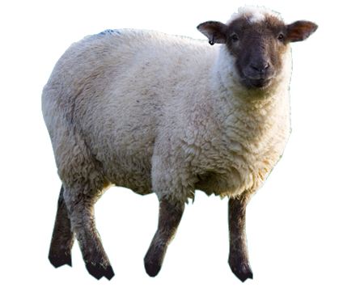

# running (linux / mac)
```
git clone https://github.com/filipkojro/ASCIIartPY.git
cd ASCIIartPY
python3 -m venv venv
source venv/bin/activate
pip3 install -r requirements.txt
python3 asciiart.py
```
# example results

